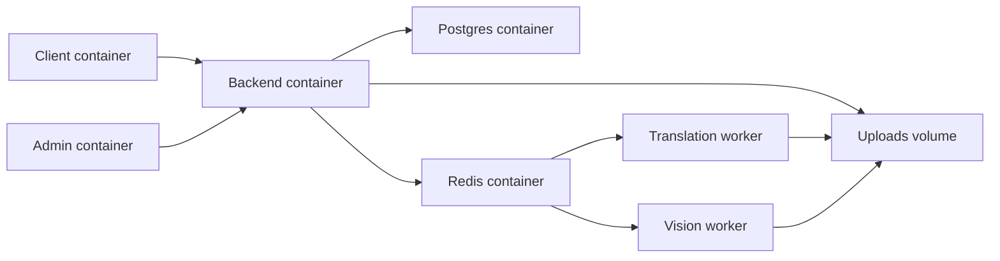
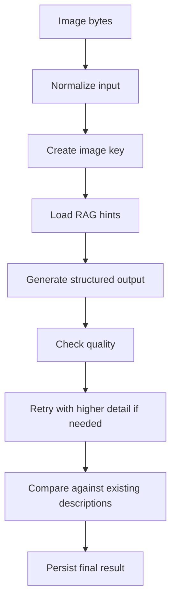
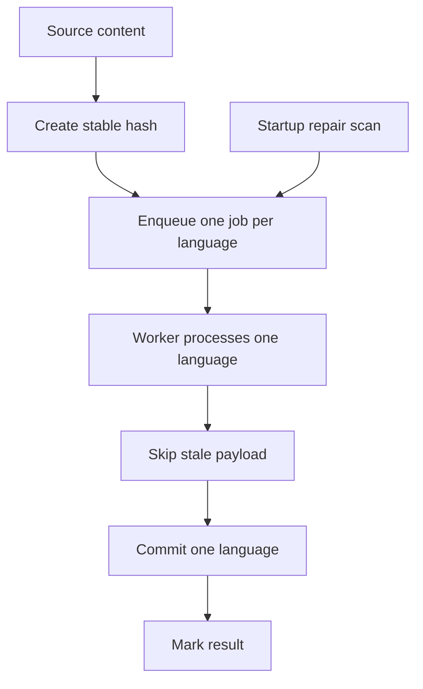

# Developer README

Engineering notes for the public showcase version of Kunstkabinett. This file is intentionally more detailed than [README.md](./README.md) and is meant for local development, code review, and architecture walkthroughs.

## Repository Map

```text
.
├─ .github/workflows/
├─ backend/
│  ├─ app/
│  │  ├─ api/
│  │  ├─ api_admin/
│  │  ├─ core/
│  │  ├─ db/
│  │  ├─ modules/
│  │  │  ├─ ai/
│  │  │  ├─ media/
│  │  │  ├─ media_inbox/
│  │  │  ├─ translation_queue/
│  │  │  └─ vision_queue/
│  │  ├─ services/
│  │  └─ tasks/
│  ├─ alembic/
│  ├─ scripts/
│  ├─ tests/
│  ├─ .env.example
│  ├─ Dockerfile
│  └─ requirements-dev.txt
├─ frontend-next/
│  ├─ app/
│  ├─ public/
│  ├─ src/
│  ├─ .env.example
│  ├─ Dockerfile
│  ├─ next.config.mjs
│  └─ package.json
├─ docker-compose.yml
├─ package.json
├─ pytest.ini
├─ README.md
└─ README.dev.md
```

## Runtime Topology



### Compose Services

| Service | Purpose | Local port |
| --- | --- | --- |
| `app_client` | Public client Next.js build | `3000` |
| `app_admin` | Admin Next.js build with `/admin` base path | `8080` |
| `app_backend` | FastAPI application | `8000` |
| `app_db` | PostgreSQL 16 | `5432` |
| `app_redis` | Redis 7 for queue coordination | internal |
| `app_translation_worker` | Translation queue worker | internal |
| `app_vision_worker` | Vision queue worker | internal |

Important detail: the admin container is built with `NEXT_PUBLIC_APP_MODE=admin`, and [frontend-next/next.config.mjs](./frontend-next/next.config.mjs) sets `basePath` to `/admin` in that mode.

## Local Development

### Option 1: Docker Compose

This is the easiest path because it covers database, Redis, migrations, backend, both frontend modes, and workers in one command.

```bash
docker compose up -d --build
```

Useful follow-up commands:

```bash
docker compose ps
docker compose logs -f app_backend
docker compose logs -f app_translation_worker
docker compose logs -f app_vision_worker
```

Primary endpoints:

- Client UI: `http://127.0.0.1:3000`
- Admin UI: `http://127.0.0.1:8080/admin`
- Backend API: `http://127.0.0.1:8000`
- FastAPI docs: `http://127.0.0.1:8000/docs`
- Health endpoint: `http://127.0.0.1:8000/health`

### Option 2: Manual Local Start

#### Backend

1. Create and activate a virtual environment for your shell.
2. Install dependencies from `backend/requirements-dev.txt`.
3. Copy `backend/.env.example` to `backend/.env` and fill in any needed values.
4. Ensure PostgreSQL and Redis are running locally.
5. Run migrations.
6. Start the API.

Example command sequence:

```bash
cd backend
python -m venv .venv
pip install -r requirements-dev.txt
alembic upgrade head
uvicorn app.main:app --reload --host 127.0.0.1 --port 8000
```

#### Workers

Translation worker:

```bash
cd backend
python -m app.modules.translation_queue.worker
```

Vision worker:

```bash
cd backend
rq worker vision
```

#### Frontend

`frontend-next/.env.example` only defines `NEXT_PUBLIC_API_BASE`, so for manual mode switching you should use `.env.local`.

Client mode:

```env
NEXT_PUBLIC_API_BASE=http://127.0.0.1:8000
NEXT_PUBLIC_APP_MODE=client
```

Admin mode:

```env
NEXT_PUBLIC_API_BASE=http://127.0.0.1:8000
NEXT_PUBLIC_APP_MODE=admin
```

Then run:

```bash
cd frontend-next
npm install
npm run dev
```

When `NEXT_PUBLIC_APP_MODE=admin`, the app uses the `/admin` base path.

## Environment Notes

### Backend env

[backend/.env.example](./backend/.env.example) includes placeholders for:

- `DATABASE_URL`
- auth secrets and token expiry
- `CORS_ORIGINS`
- optional SMTP
- `OPENAI_API_KEY`
- `DEEPSEEK_API_KEY`
- `REDIS_URL`
- translation queue retry settings
- payment and billing placeholders

### Dev admin seeding

[backend/docker-entrypoint.sh](./backend/docker-entrypoint.sh) runs migrations on container startup and then calls [backend/app/services/dev_utils.py](./backend/app/services/dev_utils.py).

If `ENV=dev` and both `DEV_ADMIN_EMAIL` and `DEV_ADMIN_PASSWORD` are present, the backend ensures an admin user exists or resets that user's password hash.

### Upload directory resolution

[backend/app/main.py](./backend/app/main.py) resolves uploads in this order:

1. `UPLOAD_DIR`
2. `/app/uploads`
3. `/var/www/kunst/uploads`
4. `./uploads`

## Application Composition

[backend/app/main.py](./backend/app/main.py) is the backend assembly point. It wires together:

- public API routers under `/api/v1`
- admin routers under `/api/admin/v1`
- client payment endpoints under `/api/client/v1`
- realtime endpoints
- AI routers
- media and inbox routes
- static upload mounting
- startup repair orchestration for missing translations
- scheduled cleanup and order expiration tasks

This matters because the backend is designed as an orchestration layer, not just a thin route bundle.

## AI Orchestration

### Main image description pipeline

Primary implementation: [backend/app/modules/ai/art/service.py](./backend/app/modules/ai/art/service.py)



Observed orchestration pattern:

1. image bytes are normalized for vision input
2. an image scoped hash key is created
3. contextual hints are loaded from the vector memory layer
4. a vision model generates structured output
5. generic output is rejected when necessary
6. the system may retry with higher image detail
7. the description is compared against existing product content
8. duplicate like output triggers regeneration
9. the final output can be written back as metadata

Architectural intent:

- RAG is used for context, not for copying stored descriptions
- generation is treated as a controlled pipeline, not a single prompt call
- duplicate suppression is enforced against relational data

### Rewrite pipeline

The same AI module supports downstream rewrite modes such as `shorten`, `marketing`, `regenerate`, and `lyric`.

Pattern:

1. generate a canonical base description
2. keep it associated with the image key
3. reload contextual hints
4. call a text model with mode specific constraints
5. return a variant while preserving factual consistency

### Inbox draft generation

Implementation: [backend/app/modules/media_inbox/ai_draft_service.py](./backend/app/modules/media_inbox/ai_draft_service.py)

The inbox flow intentionally reuses the same art description core instead of branching into a separate AI path. That keeps:

- one AI core service
- shared generation logic
- shared output structure
- lower divergence between manual and bulk workflows

### Vision queue path

Implementation: [backend/app/modules/vision_queue/jobs.py](./backend/app/modules/vision_queue/jobs.py)

The worker side flow is built for idempotent media processing:

1. receive a queued media job
2. load bytes from storage
3. compute a media hash
4. check whether the same media and model were already processed
5. skip duplicate work when possible
6. generate AI output
7. store structured result in PostgreSQL

## Translation Orchestration

Primary files:

- [backend/app/modules/translation_queue/queue.py](./backend/app/modules/translation_queue/queue.py)
- [backend/app/modules/translation_queue/jobs.py](./backend/app/modules/translation_queue/jobs.py)
- [backend/app/modules/translation_queue/worker.py](./backend/app/modules/translation_queue/worker.py)



The queue design is explicit and resilient:

1. source content is normalized into a stable payload
2. a source hash is generated from the current product content
3. one job is created per target language
4. each job uses a deterministic identifier
5. duplicate or already active jobs are skipped
6. workers process one language at a time
7. stale jobs are ignored if source content changed
8. retryable failures are retried with backoff
9. terminal failures stay distinct from transient failures
10. database commits happen per language, not as one fragile bulk write

### Startup repair flow

On backend startup, [backend/app/main.py](./backend/app/main.py) calls `enqueue_repair_missing_translations_job(offset=0)`.

The repair job:

- scans products in batches
- seeds missing translation rows
- re-enqueues only missing translations
- schedules the next batch when more work remains

This makes the translation subsystem self-healing and easier to operate after downtime or partial failures.

## Key File Entry Points

| File | Role |
| --- | --- |
| [backend/app/main.py](./backend/app/main.py) | FastAPI assembly point and startup orchestration |
| [backend/docker-entrypoint.sh](./backend/docker-entrypoint.sh) | Wait for DB, run Alembic, optionally seed dev admin |
| [backend/app/modules/ai/art/service.py](./backend/app/modules/ai/art/service.py) | Main AI description and rewrite orchestration |
| [backend/app/modules/media_inbox/ai_draft_service.py](./backend/app/modules/media_inbox/ai_draft_service.py) | Inbox to shared AI pipeline bridge |
| [backend/app/modules/vision_queue/jobs.py](./backend/app/modules/vision_queue/jobs.py) | Async vision worker job execution |
| [backend/app/modules/translation_queue/queue.py](./backend/app/modules/translation_queue/queue.py) | Translation queue creation and deduplication |
| [backend/app/modules/translation_queue/jobs.py](./backend/app/modules/translation_queue/jobs.py) | Translation repair and job execution helpers |
| [frontend-next/next.config.mjs](./frontend-next/next.config.mjs) | Mode aware frontend config and admin base path |
| [docker-compose.yml](./docker-compose.yml) | End to end local runtime definition |

## Tests And Validation

### Backend tests

From the repository root:

```bash
pytest
```

[pytest.ini](./pytest.ini) points tests to `backend/tests` and adds `backend` to `pythonpath`.

Current backend test coverage includes:

- AI HTTP retry behavior
- art description service behavior
- artist bio service behavior
- translation quality gating

### Frontend validation

From the repository root:

```bash
npm run lint
```

From `frontend-next` directly:

```bash
npm run lint
npm run typecheck
```

### CI

[.github/workflows/ci.yml](./.github/workflows/ci.yml) runs `pytest` on push and pull request using Python `3.11`.

## Public Showcase Omissions

This repo intentionally excludes:

- production domains and deployment credentials
- secret environment files
- private uploads and generated media
- database dumps and runtime artifacts
- internal runbooks and operational notes
- environment specific production settings

## Summary

The project is best understood as an orchestration showcase:

- Next.js serves both client and admin modes
- FastAPI composes public, admin, media, realtime, and AI surfaces
- PostgreSQL stores transactional state
- Redis plus RQ isolate long running workloads
- AI pipelines are tracked, deduplicated, and reused across entry points

Use [README.md](./README.md) as the GitHub landing page and this file as the engineering companion.
