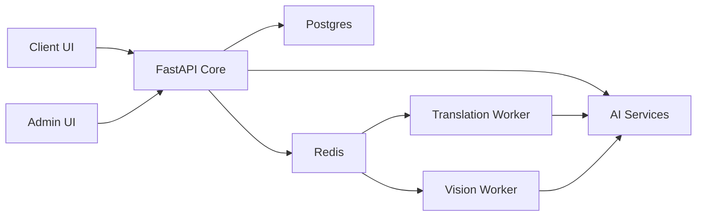
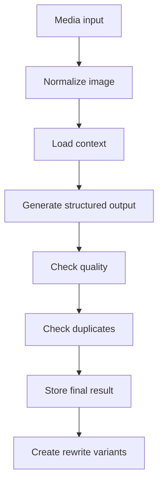

# Kunstkabinett Public Showcase

<p align="left">
  
  
  
  
  
  
</p>

Production-derived full-stack showcase focused on AI orchestration, asynchronous workers, modular FastAPI services, and containerized local development.

This public repository keeps the architecture, queue design, AI workflow structure, and local runtime model, while omitting private deployment data, secrets, uploads, and internal operational material.

## What This Repo Shows

| Area | Public showcase focus |
| --- | --- |
| Frontend | One Next.js codebase serving client and admin modes |
| Backend | FastAPI acting as the orchestration core instead of a thin CRUD layer |
| Async work | Redis plus RQ workers for translation and vision jobs |
| AI flows | Image description, rewrite, inbox draft generation, and language workflows |
| Data | PostgreSQL as the transactional source of truth with Alembic migrations |
| Local runtime | Docker Compose with isolated app, worker, database, and cache services |

## Architecture At A Glance



## Workflow Tracking

| Flow | Entry point | Async boundary | Tracking and guard rails |
| --- | --- | --- | --- |
| Image description | Admin AI routes and inbox tools | Optional vision worker path | Image hash, duplicate check, quality retry |
| Rewrite variants | Shared AI art service | Usually synchronous | Base description remains tied to the same image key |
| Translation | Product create or update events | One job per language | Source hash, deterministic job id, stale payload skip |
| Translation repair | Backend startup | Queue driven batch repair | Missing language rows only, incremental requeue |

## AI Pipeline Snapshot



## Quick Start

```bash
docker compose up -d --build
```

Primary local endpoints:

- Client UI: `http://127.0.0.1:3000`
- Admin UI: `http://127.0.0.1:8080/admin`
- Backend API: `http://127.0.0.1:8000`
- API docs: `http://127.0.0.1:8000/docs`

## Documentation Split

- Public overview: `README.md`
- Developer details: [README.dev.md](./README.dev.md)
- Frontend-specific notes: [frontend-next/README.md](./frontend-next/README.md)

## Public Showcase Boundaries

The repository intentionally does not include:

- real environment files
- production secrets or API keys
- runtime uploads and generated media
- database dumps
- internal deployment scripts
- private operational runbooks
- environment-specific production settings

## Why It Is Presented As AI Driven

The engineering focus is not just model calls. The core value is orchestration:

- deciding what stays synchronous and what moves to workers
- creating deterministic queue identities
- handling retries, stale state, and duplicate suppression
- separating retrieval context from generated output
- reusing one AI core across multiple admin entry points

Detailed implementation notes, file references, and local developer workflows are in [README.dev.md](./README.dev.md).
